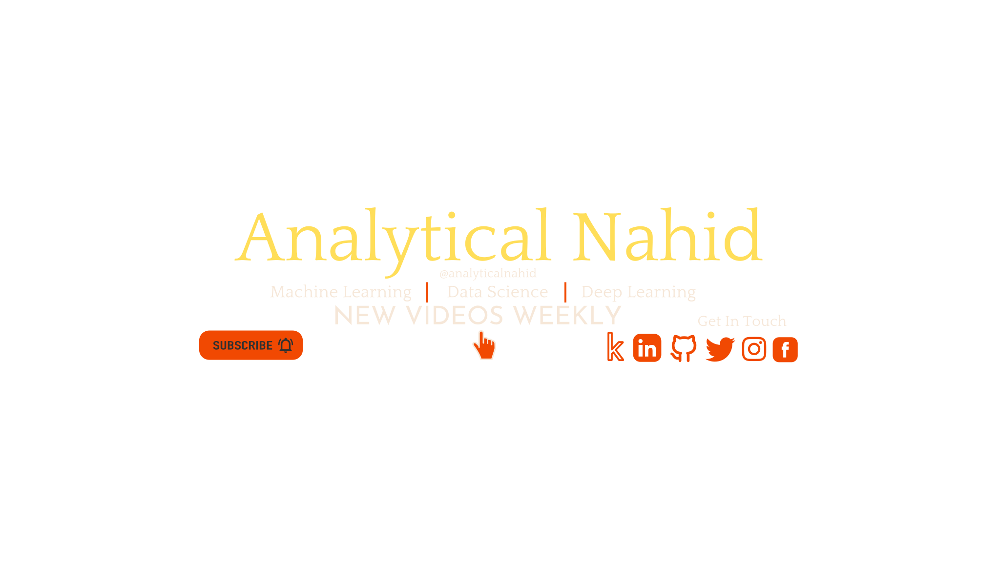

<h1 align="center">Hi  , I'm Nahidul Islam</h1>
<h3 align="center">Machine Learning & MLOps</h3>

 

<h2 align="center"> 📖 About me</h2>

💻 I'm a **Machine Learning Enginner** 
🌱 I’m currently learning **Computer Vision** 
🎨 I'm a self-taught **AI Learner** 
🎓 I'm a Computer Science student at [NIET](http://www.niet.edu.bd/) 
👨‍💻 All of my projects are available at [Analyticalnahid](https://analyticalnahid.engineer) 
📺 I make contents on [YouTube](https://www.youtube.com/channel/UCLeFKnFwC11FQWvtFk32vJQ) 
📝 I regularly write articles on [Medium](https://analyticalnahid.medium.com) 
💬 Ask me about **Machine Learning / Deep Learning** 
📫 How to reach me **analyticalnahid@gmail.com** 
⚡ Fun fact **I Love CDrama**

  
<h3 align="center">⬇ Scroll down to see <a href="https://github.com/analyticalnahid?tab=repositories">my repos</a>! ⭐ Stars are appreciated!</h3> 
<h2 align="center"> 🙋&zwj;♂️ Connect with me:</h2>  

  
<h2 align="center"> 👨&zwj;💻 Languages and Tools:</h2>
  

                     

 
<h2 align="center">💻 Most used languages</h2>
  
  
  
 

<h3 id="📺-latest-youtube-videos">📺 Latest YouTube Videos</h3>

<!-- YOUTUBE-VIDEOS-LIST:START -->
- [The Spark Foundation &lpar;Computer Vision &amp; IoT Internship&rpar; | TASK03 | Analytical Nahid](https://www.youtube.com/watch?v=RE3klBTFr-A)
- [The Spark Foundation &lpar;Computer Vision &amp; IoT Internship&rpar; | Task02 | Analytical Nahid](https://www.youtube.com/watch?v=bqhp94vSCD8)
- [The Spark Foundation &lpar;Computer Vision &amp; IoT Internship&rpar; | Task01 | Analytical Nahid](https://www.youtube.com/watch?v=yhYjfOuCAa4)
- [Movie Recommendation System Content Based Filtering || Recommendation System || Analytical Nahid](https://www.youtube.com/watch?v=R6DidWKoSgQ)
- [Optical Character Reader || OCR || Analytical Nahid](https://www.youtube.com/watch?v=tks_2EUGVLA)
<!-- YOUTUBE-VIDEOS-LIST:END -->

---
  
  
<h3 id="📕-latest-blog-posts">📕 Latest Blog Posts</h3>  
